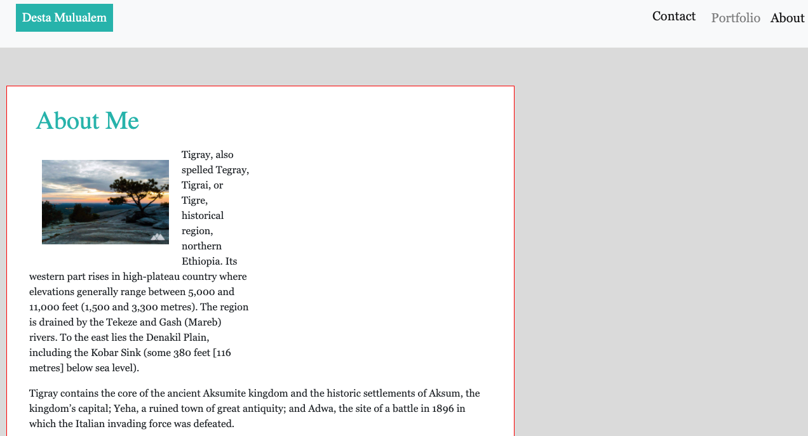
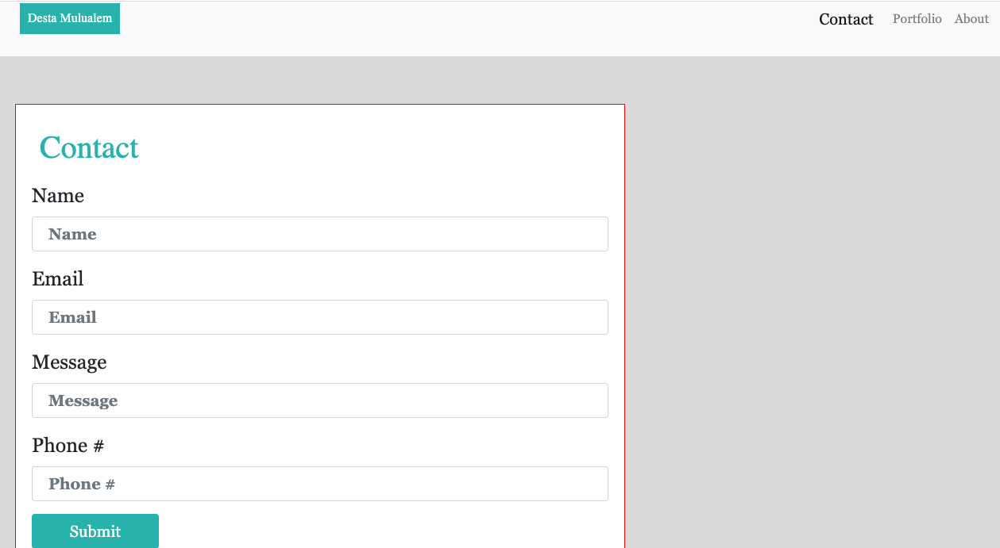
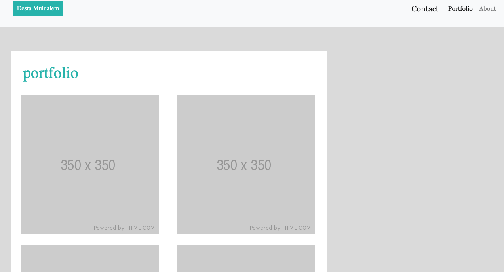

# history
I used Bootstrap link to fixed navbar and as well as font awesome.min.css.
I add the javascript to be active my navbar link.
I attached the or linked media quiry to response my web page.
I use semantic syntax for adjust my html.

URL: https://destish21.github.io/my-portfolio/
