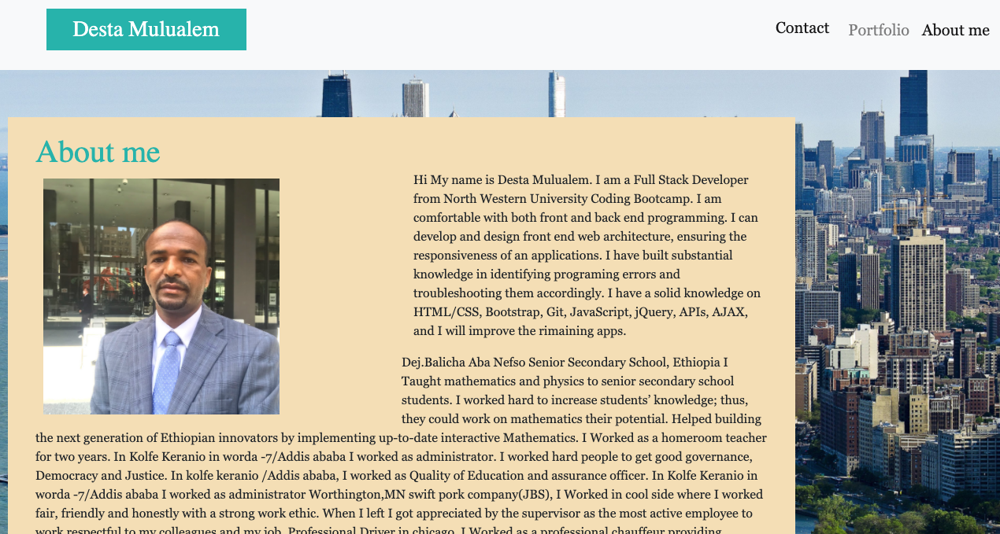
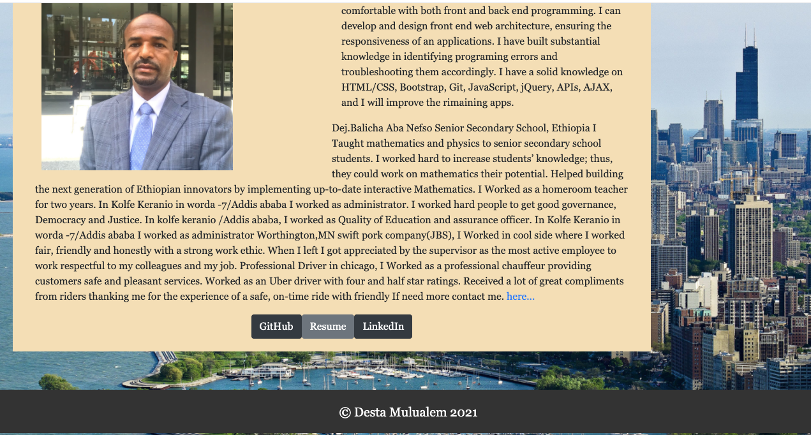

# my-portfolio

I used Bootstrap link to fixed navbar and as well as font awesome.min.css.
I add the javascript to be active my navbar link.
I attached the or linked media quiry to response my web page.
I use semantic syntax for adjust my index.html,contact.html, portfolio.html and styled eachof them by styling sheet css.
I put my contact information my name, addres, phone number and email addres.
I had form any body can write messege with full information and hit submit button.
I attached my github link, Resume link, and Linkedin link all are active.
All my html and css is clean and brief
Screenshot of my first project some of my home work projeckes with their github link and Deployed links attached and active.

URL:  https://destish21.github.io/my-portfolio/
